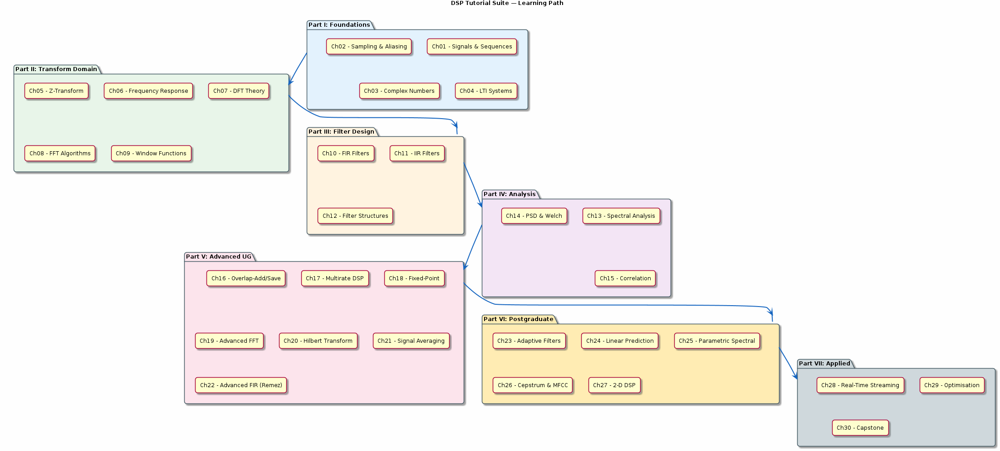

# Chapter 0: Course Overview

Roadmap, prerequisites, and how to use this tutorial suite.

## Concept Diagram

## Contents

| File | Description |
|------|------------|
| [tutorial.md](tutorial.md) | Full theory tutorial with equations and exercises |
| [demo.c](demo.c) | Self-contained runnable demo |

## What You'll Learn

- Understand the 7-part structure of the DSP tutorial suite
- Set up the build environment (GCC + Make + gnuplot)
- Run your first demo and generate signal plots
- Navigate between tutorials, demos, and API headers

---

[Index](../../reference/CHAPTER_INDEX.md) | [Ch 1 →](../01-signals-and-sequences/README.md)
