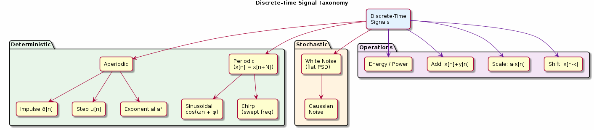

# Chapter 1: Discrete-Time Signals & Sequences

Signal types, generation, and fundamental operations.

## Concept Diagram

## Contents

| File | Description |
|------|------------|
| [tutorial.md](tutorial.md) | Full theory tutorial with equations and exercises |
| [demo.c](demo.c) | Self-contained runnable demo |
| [`signal_gen.h`](../../include/signal_gen.h) | Library API |

## What You'll Learn

- Classify signals: impulse, step, exponential, sinusoidal, chirp
- Generate standard test signals using the `signal_gen` module
- Compute signal energy and power
- Perform basic operations: shift, scale, add

---

[← Ch 0](../00-overview/README.md) | [Index](../../reference/CHAPTER_INDEX.md) | [Ch 2 →](../02-sampling-and-aliasing/README.md)
