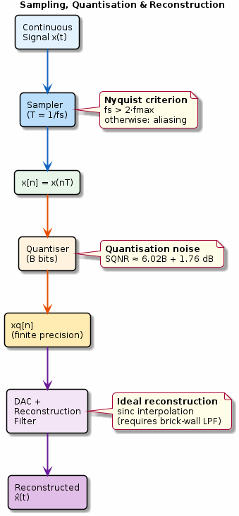

# Chapter 2: Sampling & Aliasing

Nyquist criterion, quantisation, and reconstruction.

## Concept Diagram

## Contents

| File | Description |
|------|------------|
| [tutorial.md](tutorial.md) | Full theory tutorial with equations and exercises |
| [demo.c](demo.c) | Self-contained runnable demo |

## What You'll Learn

- Apply the Nyquist–Shannon sampling theorem
- Detect and prevent aliasing in sampled signals
- Understand quantisation noise and SQNR
- Reconstruct continuous signals via sinc interpolation

---

[← Ch 1](../01-signals-and-sequences/README.md) | [Index](../../reference/CHAPTER_INDEX.md) | [Ch 3 →](../03-complex-numbers/README.md)
