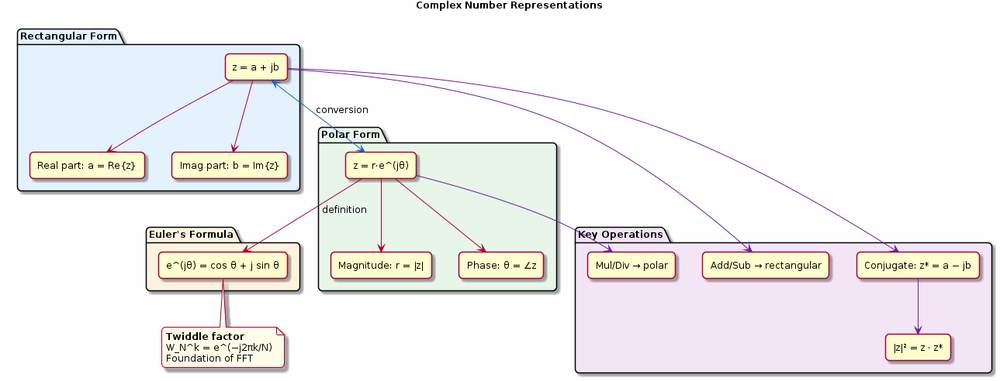

# Chapter 3: Complex Numbers in DSP

Rectangular and polar forms, Euler's formula, phasors.

## Concept Diagram

## Contents

| File | Description |
|------|------------|
| [tutorial.md](tutorial.md) | Full theory tutorial with equations and exercises |
| [demo.c](demo.c) | Self-contained runnable demo |
| [`dsp_utils.h`](../../include/dsp_utils.h) | Library API |

## What You'll Learn

- Convert between rectangular and polar representations
- Apply Euler's formula to DSP problems
- Understand twiddle factors as complex exponentials
- Compute magnitude and phase of complex signals

---

[← Ch 2](../02-sampling-and-aliasing/README.md) | [Index](../../reference/CHAPTER_INDEX.md) | [Ch 4 →](../04-lti-systems/README.md)
