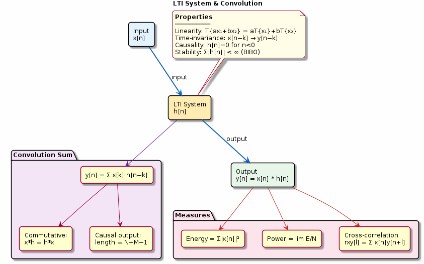

# Chapter 4: LTI Systems & Convolution

Linear time-invariant systems, impulse response, and convolution sum.

## Concept Diagram

## Contents

| File | Description |
|------|------------|
| [tutorial.md](tutorial.md) | Full theory tutorial with equations and exercises |
| [demo.c](demo.c) | Self-contained runnable demo |
| [`convolution.h`](../../include/convolution.h) | Library API |

## What You'll Learn

- Test a system for linearity and time-invariance
- Compute output via convolution sum y[n] = x[n] * h[n]
- Verify BIBO stability from the impulse response
- Relate energy, power, and cross-correlation

---

[← Ch 3](../03-complex-numbers/README.md) | [Index](../../reference/CHAPTER_INDEX.md) | [Ch 5 →](../05-z-transform/README.md)
