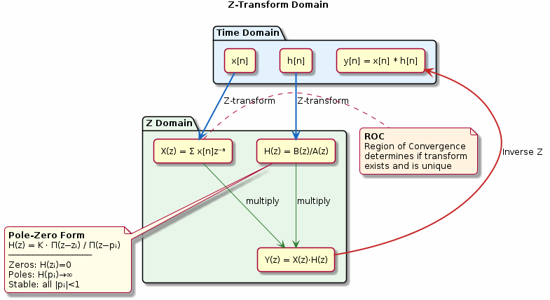

# Chapter 5: The Z-Transform

Transfer functions, poles, zeros, and the region of convergence.

## Concept Diagram

## Contents

| File | Description |
|------|------------|
| [tutorial.md](tutorial.md) | Full theory tutorial with equations and exercises |
| [demo.c](demo.c) | Self-contained runnable demo |

## What You'll Learn

- Compute the Z-transform of common sequences
- Determine system stability from pole locations
- Relate time-domain convolution to Z-domain multiplication
- Identify the region of convergence (ROC)

---

[← Ch 4](../04-lti-systems/README.md) | [Index](../../reference/CHAPTER_INDEX.md) | [Ch 6 →](../06-frequency-response/README.md)
