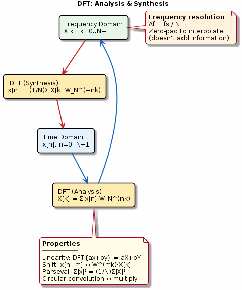

# Chapter 7: DFT Theory

The Discrete Fourier Transform: analysis, synthesis, and properties.

## Concept Diagram

## Contents

| File | Description |
|------|------------|
| [tutorial.md](tutorial.md) | Full theory tutorial with equations and exercises |
| [demo.c](demo.c) | Self-contained runnable demo |

## What You'll Learn

- Compute the DFT and IDFT from first principles
- Apply key DFT properties: linearity, shift, Parseval's theorem
- Understand circular convolution vs linear convolution
- Choose appropriate DFT length and zero-padding

---

[← Ch 6](../06-frequency-response/README.md) | [Index](../../reference/CHAPTER_INDEX.md) | [Ch 8 →](../08-fft-fundamentals/README.md)
