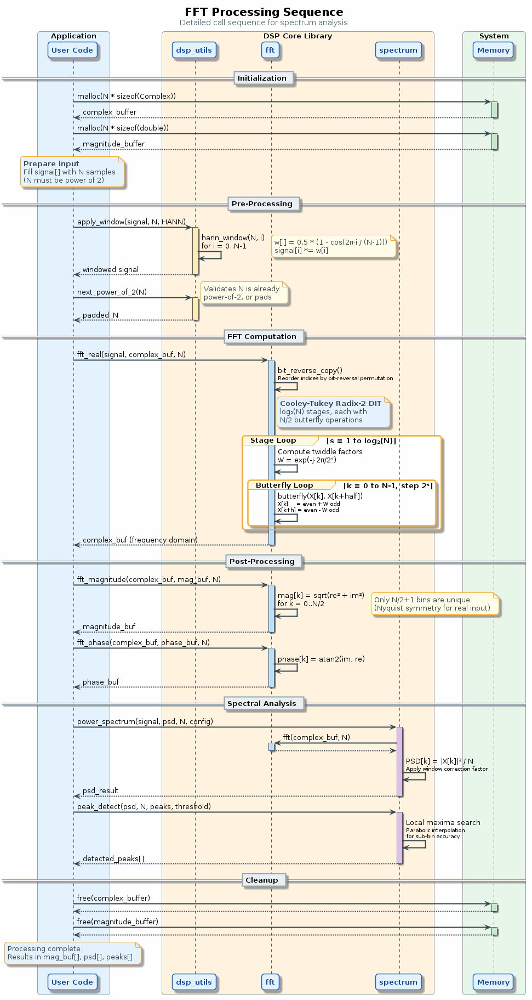

# Chapter 8: FFT Algorithms

Cooley-Tukey radix-2 and radix-4 fast Fourier transforms.

## Concept Diagram

## Contents

| File | Description |
|------|------------|
| [tutorial.md](tutorial.md) | Full theory tutorial with equations and exercises |
| [demo.c](demo.c) | Self-contained runnable demo |
| [`fft.h`](../../include/fft.h) | Library API |

## What You'll Learn

- Trace the butterfly operations in radix-2 FFT
- Understand how radix-4 achieves fewer multiplications
- Verify FFT output against direct DFT computation
- Use the `fft` module for forward and inverse transforms

---

[← Ch 7](../07-dft-theory/README.md) | [Index](../../reference/CHAPTER_INDEX.md) | [Ch 9 →](../09-window-functions/README.md)
