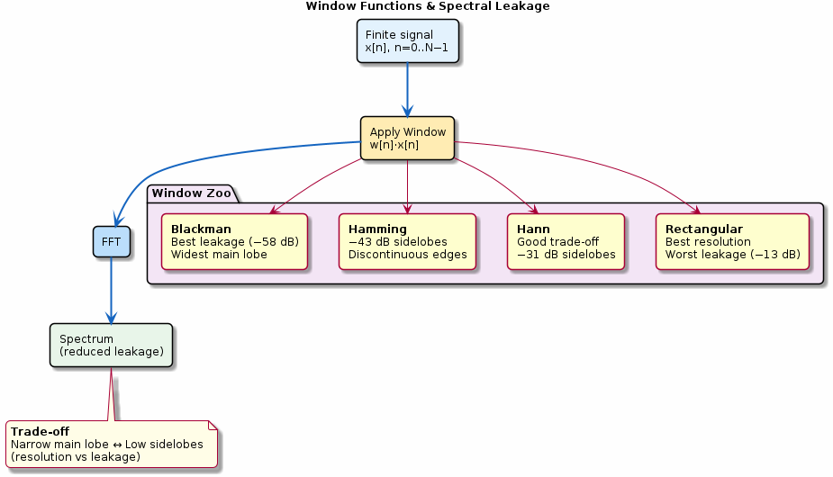

# Chapter 9: Window Functions

Spectral leakage, window types, and the resolution–leakage trade-off.

## Concept Diagram

## Contents

| File | Description |
|------|------------|
| [tutorial.md](tutorial.md) | Full theory tutorial with equations and exercises |
| [demo.c](demo.c) | Self-contained runnable demo |
| [`dsp_utils.h`](../../include/dsp_utils.h) | Library API |

## What You'll Learn

- Explain why truncation causes spectral leakage
- Compare Hann, Hamming, and Blackman windows
- Choose a window based on main-lobe width vs sidelobe level
- Apply windows before FFT analysis

---

[← Ch 8](../08-fft-fundamentals/README.md) | [Index](../../reference/CHAPTER_INDEX.md) | [Ch 10 →](../10-digital-filters/README.md)
