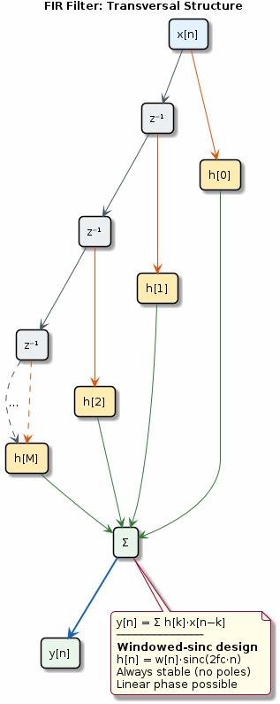

# Chapter 10: FIR Digital Filters

Windowed-sinc design, linear phase, and transversal structure.

## Concept Diagram

## Contents

| File | Description |
|------|------------|
| [tutorial.md](tutorial.md) | Full theory tutorial with equations and exercises |
| [demo.c](demo.c) | Self-contained runnable demo |
| [`filter.h`](../../include/filter.h) | Library API |

## What You'll Learn

- Design lowpass/highpass FIR filters using sinc + window
- Understand linear-phase conditions (symmetric coefficients)
- Implement the transversal (direct-form) FIR structure
- Trade off filter order vs transition bandwidth

---

[← Ch 9](../09-window-functions/README.md) | [Index](../../reference/CHAPTER_INDEX.md) | [Ch 11 →](../11-iir-filter-design/README.md)
