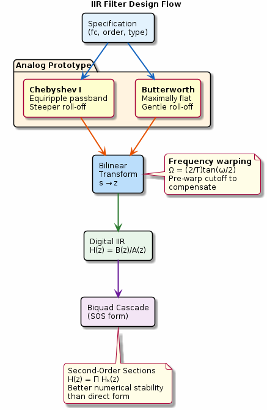

# Chapter 11: IIR Filter Design

Butterworth and Chebyshev prototypes, bilinear transform.

## Concept Diagram

## Contents

| File | Description |
|------|------------|
| [tutorial.md](tutorial.md) | Full theory tutorial with equations and exercises |
| [demo.c](demo.c) | Self-contained runnable demo |
| [`iir.h`](../../include/iir.h) | Library API |

## What You'll Learn

- Design Butterworth and Chebyshev Type-I IIR filters
- Apply the bilinear transform with frequency pre-warping
- Convert to second-order sections for numerical stability
- Compare IIR and FIR for a given specification

---

[← Ch 10](../10-digital-filters/README.md) | [Index](../../reference/CHAPTER_INDEX.md) | [Ch 12 →](../12-filter-structures/README.md)
