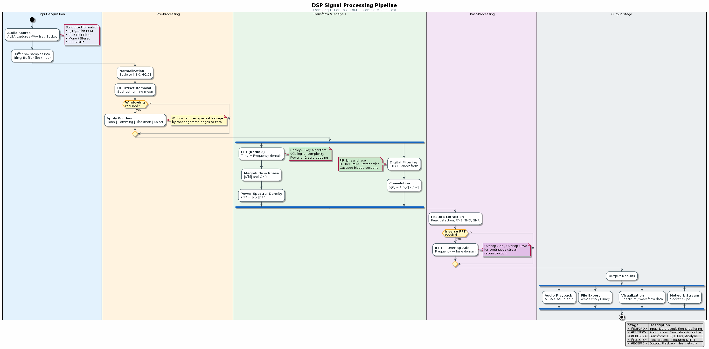

# Chapter 13: Spectral Analysis

Periodogram, spectral estimation, and frequency-domain interpretation.

## Concept Diagram

## Contents

| File | Description |
|------|------------|
| [tutorial.md](tutorial.md) | Full theory tutorial with equations and exercises |
| [demo.c](demo.c) | Self-contained runnable demo |
| [`spectrum.h`](../../include/spectrum.h) | Library API |

## What You'll Learn

- Compute and interpret the periodogram
- Identify frequency components in noisy signals
- Convert between linear and dB magnitude scales
- Use the `spectrum` module for power spectral analysis

---

[← Ch 12](../12-filter-structures/README.md) | [Index](../../reference/CHAPTER_INDEX.md) | [Ch 14 →](../14-psd-welch/README.md)
