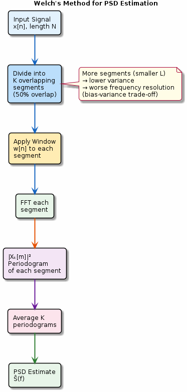

# Chapter 14: PSD & Welch's Method

Consistent power spectral density estimation via segment averaging.

## Concept Diagram

## Contents

| File | Description |
|------|------------|
| [tutorial.md](tutorial.md) | Full theory tutorial with equations and exercises |
| [demo.c](demo.c) | Self-contained runnable demo |
| [`spectrum.h`](../../include/spectrum.h) | Library API |

## What You'll Learn

- Understand the bias-variance trade-off in PSD estimation
- Apply Welch's method: segment, window, FFT, average
- Choose segment length and overlap for your application
- Compare periodogram, Bartlett, and Welch estimators

---

[← Ch 13](../13-spectral-analysis/README.md) | [Index](../../reference/CHAPTER_INDEX.md) | [Ch 15 →](../15-correlation/README.md)
