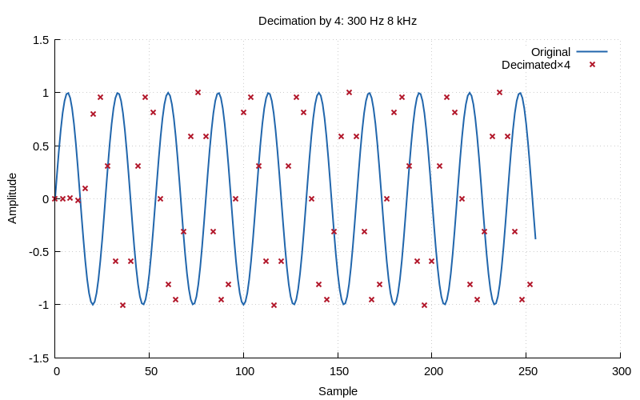
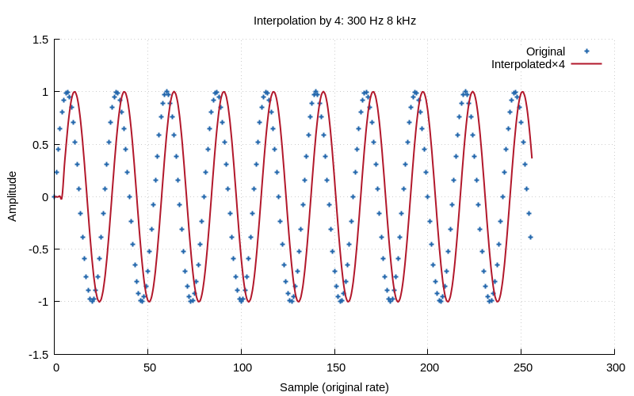
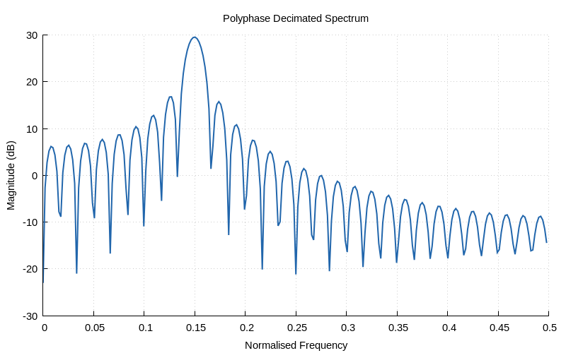

# Chapter 17 — Multirate DSP

## Overview

Multirate DSP processes signals at **different sampling rates** within the same
system. The two fundamental operations are **decimation** (rate reduction) and
**interpolation** (rate increase). Combined, they form **rational rate
conversion** (L/M). The **polyphase structure** makes these operations
efficient by operating at the lower rate.

## Key Concepts

### Decimation by M

Reduce the sampling rate by integer factor M:

1. **Anti-alias filter**: LPF with cutoff fc = fs/(2M).
2. **Downsample**: Keep every M-th sample, discard the rest.

Without the anti-alias filter, frequencies above the new Nyquist fold back,
corrupting the signal (aliasing).

### Interpolation by L

Increase the sampling rate by integer factor L:

1. **Upsample**: Insert L−1 zeros between each sample.
2. **Anti-image filter**: LPF with cutoff fc = fs/(2L), gain = L.

Zero-insertion creates spectral images (copies) that must be removed.

### Rational Rate Conversion

Convert from fs to fs × L/M:

1. Upsample by L (zero-insert + filter).
2. Downsample by M (filter + keep every M-th).
3. Combine both anti-alias/anti-image into one filter: cutoff = min(1/L, 1/M)/2.

### Noble Identities

These identities allow moving filters past rate-change operators:

- **Downsample**: H(z) followed by ↓M = ↓M followed by H(z^M)
- **Upsample**: ↑L followed by H(z) = H(z^L) followed by ↑L

This leads to the **polyphase decomposition**.

### Polyphase Decomposition

Any FIR filter H(z) can be decomposed into M sub-filters:

    H(z) = Σ_{k=0}^{M-1} z^{-k} · E_k(z^M)

where E_k contains every M-th coefficient: E_k[m] = h[k + mM].

For **decimation**, this means:
- Split input into M polyphase branches.
- Each branch filters at rate fs/M (not fs).
- Sum the outputs.
- Result: M× fewer multiplies than direct implementation.

## Computational Cost

| Method         | Multiplies per output |
|---------------|----------------------|
| Direct         | N_taps × fs         |
| Polyphase      | N_taps × fs/M       |
| Savings        | Factor of M          |

## API Reference

```c
#include "multirate.h"

int decimate(const double *x, int n, int M, double *y);
int interpolate(const double *x, int n, int L, double *y);
int resample(const double *x, int n, int L, int M, double *y);
int polyphase_decimate(const double *x, int n,
                       const double *h, int taps, int M, double *y);
```

## Running the Demo

```bash
make chapters
./build/bin/ch17
```

### Generated Plots







## Cross-References

- [Chapter 10: FIR Filters](10-fir-filter-design.md) — anti-alias FIR design
- [Chapter 22: Advanced FIR](22-advanced-fir.md) — Remez optimal filter for multirate
- [Chapter 08: FFT](08-fft.md) — spectral analysis of decimated signals
