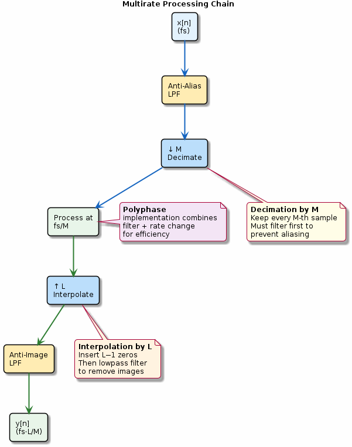

# Chapter 17: Multirate DSP

Decimation, interpolation, and polyphase filters.

## Concept Diagram

## Contents

| File | Description |
|------|------------|
| [tutorial.md](tutorial.md) | Full theory tutorial with equations and exercises |
| [demo.c](demo.c) | Self-contained runnable demo |
| [`multirate.h`](../../include/multirate.h) | Library API |

## What You'll Learn

- Decimate a signal with an anti-alias prefilter
- Interpolate a signal with an anti-image postfilter
- Combine decimation and interpolation for rational rate conversion
- Understand the polyphase decomposition for efficiency

---

[← Ch 16](../16-overlap-add-save/README.md) | [Index](../../reference/CHAPTER_INDEX.md) | [Ch 18 →](../18-fixed-point/README.md)
