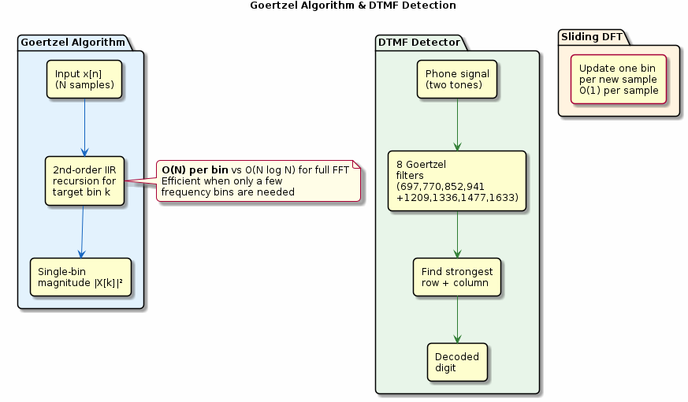

# Chapter 19: Advanced FFT Applications

Goertzel algorithm, DTMF detection, and sliding DFT.

## Concept Diagram

## Contents

| File | Description |
|------|------------|
| [tutorial.md](tutorial.md) | Full theory tutorial with equations and exercises |
| [demo.c](demo.c) | Self-contained runnable demo |
| [`advanced_fft.h`](../../include/advanced_fft.h) | Library API |

## What You'll Learn

- Detect a single frequency bin efficiently with Goertzel
- Build a DTMF tone detector using 8 Goertzel filters
- Implement the sliding DFT for continuous monitoring
- Choose Goertzel vs FFT based on the number of bins needed

---

[← Ch 18](../18-fixed-point/README.md) | [Index](../../reference/CHAPTER_INDEX.md) | [Ch 20 →](../20-hilbert-transform/README.md)
