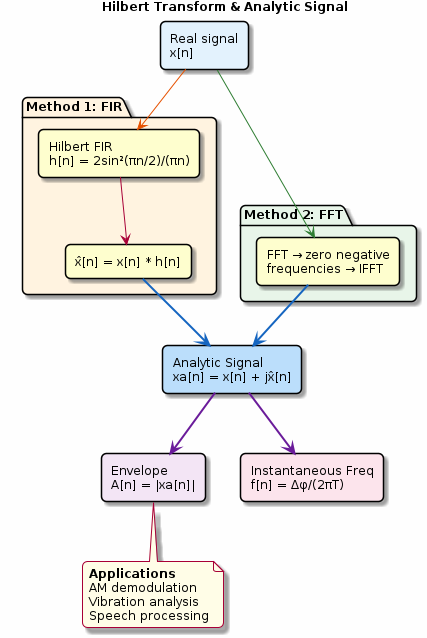

# Chapter 20: Hilbert Transform

Analytic signal construction, envelope, and instantaneous frequency.

## Concept Diagram

## Contents

| File | Description |
|------|------------|
| [tutorial.md](tutorial.md) | Full theory tutorial with equations and exercises |
| [demo.c](demo.c) | Self-contained runnable demo |
| [`hilbert.h`](../../include/hilbert.h) | Library API |

## What You'll Learn

- Construct the analytic signal via FIR or FFT methods
- Extract the signal envelope (AM demodulation)
- Compute instantaneous frequency from phase differences
- Apply the Hilbert transform to vibration and speech analysis

---

[← Ch 19](../19-advanced-fft/README.md) | [Index](../../reference/CHAPTER_INDEX.md) | [Ch 21 →](../21-signal-averaging/README.md)
