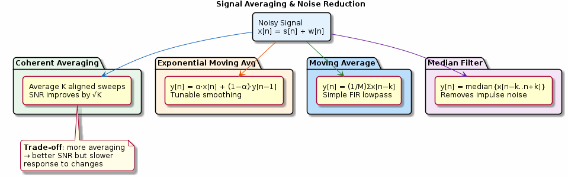

# Chapter 21: Signal Averaging

Coherent averaging, moving average, exponential smoothing, and median filtering.

## Concept Diagram

## Contents

| File | Description |
|------|------------|
| [tutorial.md](tutorial.md) | Full theory tutorial with equations and exercises |
| [demo.c](demo.c) | Self-contained runnable demo |
| [`averaging.h`](../../include/averaging.h) | Library API |

## What You'll Learn

- Improve SNR by √K using coherent averaging
- Implement moving average and exponential smoothing filters
- Remove impulse noise with a median filter
- Choose an averaging method for your noise characteristics

---

[← Ch 20](../20-hilbert-transform/README.md) | [Index](../../reference/CHAPTER_INDEX.md) | [Ch 22 →](../22-advanced-fir/README.md)
