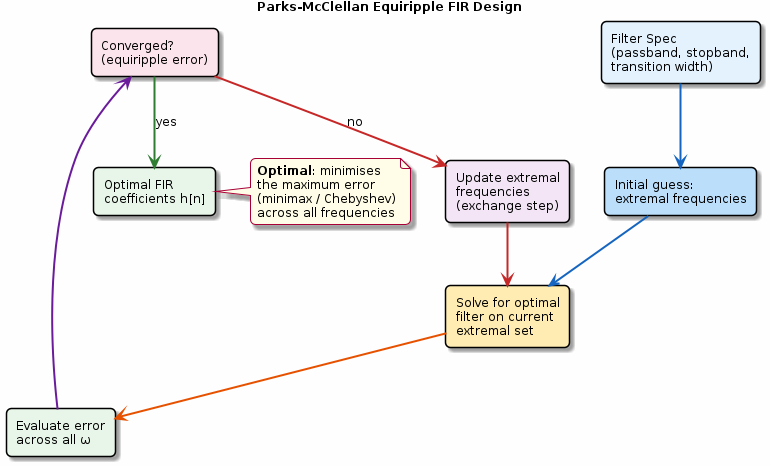

# Chapter 22: Advanced FIR Design (Remez)

Parks-McClellan equiripple FIR design via the Remez exchange algorithm.

## Concept Diagram

## Contents

| File | Description |
|------|------------|
| [tutorial.md](tutorial.md) | Full theory tutorial with equations and exercises |
| [demo.c](demo.c) | Self-contained runnable demo |
| [`remez.h`](../../include/remez.h) | Library API |

## What You'll Learn

- Specify passband/stopband edges and weights
- Understand the Remez exchange (minimax) iteration
- Design equiripple lowpass/bandpass/highpass FIR filters
- Compare equiripple vs windowed-sinc designs

---

[← Ch 21](../21-signal-averaging/README.md) | [Index](../../reference/CHAPTER_INDEX.md) | [Ch 23 →](../23-adaptive-filters/README.md)
