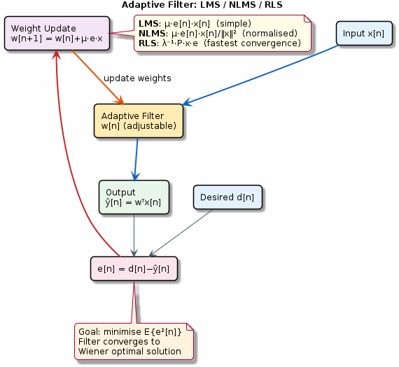

# Chapter 23: Adaptive Filters

LMS, NLMS, and RLS algorithms for real-time adaptation.

## Concept Diagram

## Contents

| File | Description |
|------|------------|
| [tutorial.md](tutorial.md) | Full theory tutorial with equations and exercises |
| [demo.c](demo.c) | Self-contained runnable demo |
| [`adaptive.h`](../../include/adaptive.h) | Library API |

## What You'll Learn

- Implement the LMS adaptive filter algorithm
- Tune the step size μ for convergence vs stability
- Compare NLMS (normalised) and RLS (recursive least squares)
- Apply adaptive filtering to noise cancellation

---

[← Ch 22](../22-advanced-fir/README.md) | [Index](../../reference/CHAPTER_INDEX.md) | [Ch 24 →](../24-linear-prediction/README.md)
