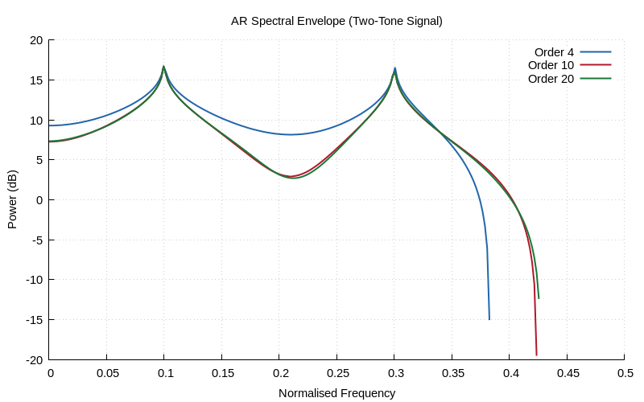

# Chapter 24 — Linear Prediction Coding (LPC)

## Overview

**Linear Prediction Coding** models a signal as a linear combination of its
past values. Originally developed for speech coding, LPC is fundamental to
speech synthesis, compression (GSM, CELP), and spectral analysis. The
**Levinson-Durbin** algorithm solves the prediction equations efficiently
by exploiting Toeplitz structure.

## Key Concepts

### The Linear Prediction Model

Predict x[n] from p previous samples:

$$\hat{x}[n] = -\sum_{k=1}^{p} a_k \, x[n-k]$$

The prediction error (residual):

$$e[n] = x[n] + \sum_{k=1}^{p} a_k \, x[n-k] = x[n] - \hat{x}[n]$$

### Analysis and Synthesis

```
Analysis (encoder):
  x[n] → [A(z)] → e[n]   (flat residual — compress this)

Synthesis (decoder):
  e[n] → [1/A(z)] → x̂[n]  (reconstruct signal)
```

The analysis filter A(z) = 1 + a₁z⁻¹ + ··· + aₚz⁻ᵖ whitens the signal.
The synthesis filter 1/A(z) is an all-pole IIR filter that reconstructs
the original from the residual.

### Autocorrelation Method

The optimal LPC coefficients minimise E{e²[n]}, leading to the
**normal equations** (Yule-Walker):

$$\mathbf{R} \cdot \mathbf{a} = -\mathbf{r}$$

where R is the Toeplitz autocorrelation matrix and r = [r(1)...r(p)]ᵀ.

### Levinson-Durbin Algorithm

Solves the normal equations in O(p²) time (vs O(p³) for general methods):

1. **Initialise**: E₀ = r(0), a₁⁽¹⁾ = k₁ = −r(1)/r(0)
2. **Recursion** (i = 2..p):
   - kᵢ = −[r(i) + Σⱼ aⱼ⁽ⁱ⁻¹⁾ r(i−j)] / Eᵢ₋₁
   - aᵢ⁽ⁱ⁾ = kᵢ
   - aⱼ⁽ⁱ⁾ = aⱼ⁽ⁱ⁻¹⁾ + kᵢ · aᵢ₋ⱼ⁽ⁱ⁻¹⁾  for j = 1..i−1
   - Eᵢ = (1 − kᵢ²) · Eᵢ₋₁
3. **Output**: a[1..p], prediction error energy E_p

### Reflection Coefficients

The intermediate values kᵢ are **reflection coefficients** (also called
PARCOR coefficients). They have important properties:

- **Stability**: |kᵢ| < 1 for all i ⟹ stable all-pole model
- **Lattice structure**: kᵢ directly give the lattice filter stages
- **Quantisation**: kᵢ is bounded ∈ (−1, 1), better for coding than aᵢ

### AR Spectral Envelope

The all-pole model provides a smoothed spectral estimate:

$$S(f) = \frac{E_p}{|A(e^{j2\pi f})|^2}$$

This is equivalent to an **autoregressive (AR) spectral estimator**.
Higher order p captures more spectral detail:
- Too low → over-smoothed, misses peaks
- Too high → spurious peaks, matches noise

## Prediction Order Selection

| Application | Typical Order p |
|------------|----------------|
| Narrowband speech (8 kHz) | 10–12 |
| Wideband speech (16 kHz) | 16–20 |
| Music/audio | 20–50 |
| Rule of thumb | fs/1000 + 2 |

## Applications

- **Speech coding**: GSM (13 kbit/s), CELP, LPC-10 vocoder
- **Speech synthesis**: Source-filter model (excitation + vocal tract)
- **Spectral analysis**: AR spectral envelope for formant tracking
- **Compression**: Encode residual (near-white) with fewer bits

## Implementation Notes

- Always check |kᵢ| < 1 for stability during recursion
- Apply a window (Hamming) to the frame before autocorrelation
- Pre-emphasis filter (1 − 0.97z⁻¹) flattens the spectral tilt
- Frame size typically 20–30 ms with 50% overlap

## Demo

Run the Chapter 24 demo:
```bash
make chapters && ./build/bin/ch24
```

### Generated Plots




## Further Reading

- Makhoul, "Linear Prediction: A Tutorial Review," *Proc. IEEE* (1975)
- Rabiner & Schafer, *Digital Processing of Speech Signals*, Chapter 8
- Haykin, *Adaptive Filter Theory*, Chapter 3 (Wiener filters)
