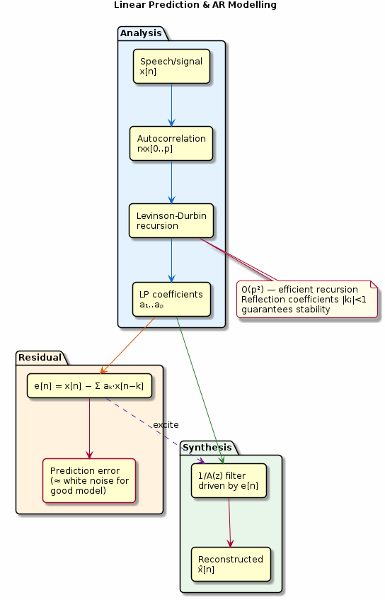

# Chapter 24: Linear Prediction

Autoregressive modelling, Levinson-Durbin, and LP analysis-synthesis.

## Concept Diagram

## Contents

| File | Description |
|------|------------|
| [tutorial.md](tutorial.md) | Full theory tutorial with equations and exercises |
| [demo.c](demo.c) | Self-contained runnable demo |
| [`lpc.h`](../../include/lpc.h) | Library API |

## What You'll Learn

- Estimate LP coefficients via autocorrelation + Levinson-Durbin
- Check stability through reflection coefficients
- Compute the prediction error (residual) signal
- Synthesise a signal from LP coefficients and excitation

---

[← Ch 23](../23-adaptive-filters/README.md) | [Index](../../reference/CHAPTER_INDEX.md) | [Ch 25 →](../25-parametric-spectral/README.md)
