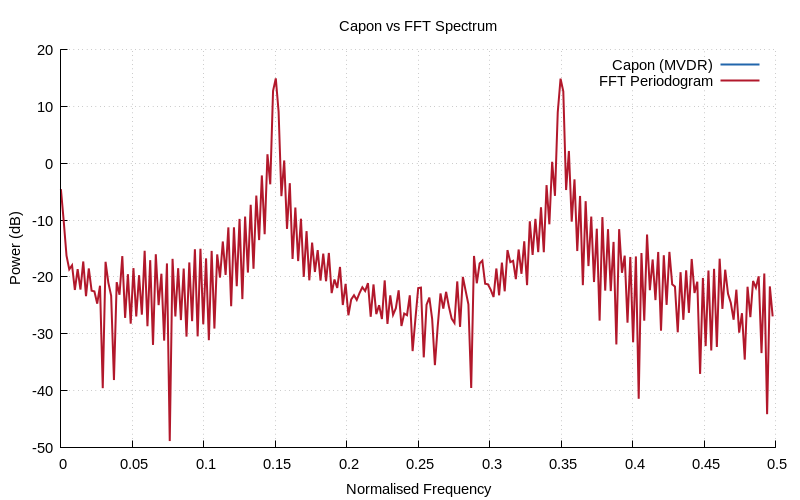

# Chapter 25 — Parametric Spectral Estimation: MUSIC & Capon

## Overview

Classical spectral estimation (periodogram, Welch) has a fundamental
resolution limit of Δf = 1/N. **Parametric** and **subspace** methods
break this limit by exploiting signal structure, achieving
**super-resolution** — the ability to distinguish closely-spaced
frequency components even with short data records.

## Key Concepts

### The Resolution Problem

For N samples, the FFT-based frequency resolution is:
$$\Delta f = \frac{1}{N}$$

Two sinusoids at frequencies f₁ and f₂ with |f₁ − f₂| < 1/N cannot
be resolved by the periodogram. Parametric methods exploit the model
structure to overcome this limit.

### Signal Model

Assume the observed signal is a sum of M complex sinusoids in noise:

$$x[n] = \sum_{k=1}^{M} A_k e^{j2\pi f_k n} + w[n]$$

The correlation matrix R = E{xxᴴ} has structure:
$$\mathbf{R} = \mathbf{A}\mathbf{P}\mathbf{A}^H + \sigma^2\mathbf{I}$$

where A is the Vandermonde steering matrix and P = diag(|A₁|²,...,|Aₘ|²).

### Eigendecomposition

The eigenvalues of R decompose into:
- **M signal eigenvalues** (large): λ₁ ≥ ··· ≥ λₘ > σ²
- **(p−M) noise eigenvalues** (small): λₘ₊₁ ≈ ··· ≈ λₚ ≈ σ²

The corresponding eigenvectors span two orthogonal subspaces:
- **Signal subspace**: spanned by v₁, ..., vₘ
- **Noise subspace**: spanned by vₘ₊₁, ..., vₚ

Key property: the steering vectors a(fₖ) are orthogonal to the noise
subspace eigenvectors.

### MUSIC (MUltiple SIgnal Classification)

Exploits the orthogonality between signal steering vectors and the
noise subspace:

$$P_{MUSIC}(f) = \frac{1}{\sum_{k=M+1}^{p} |e^H(f) \cdot v_k|^2}$$

- **Pseudospectrum** (not a true PSD) — amplitude is not meaningful
- Peaks at signal frequencies where e(f) ⊥ noise subspace
- Infinitely sharp peaks in theory (limited by noise in practice)
- Requires knowing M (number of signals)

### Capon (MVDR — Minimum Variance Distortionless Response)

Designs a data-adaptive beamformer that passes frequency f with unit
gain while minimising output power from all other frequencies:

$$P_{Capon}(f) = \frac{1}{\mathbf{e}^H(f) \, \mathbf{R}^{-1} \, \mathbf{e}(f)}$$

- True PSD estimator (power has physical meaning)
- Better resolution than periodogram
- Does NOT require knowing M
- Narrower peaks than FFT, but broader than MUSIC

### Comparison

| Feature | FFT/Periodogram | Capon (MVDR) | MUSIC |
|---------|----------------|--------------|-------|
| Resolution | 1/N | Better than 1/N | Super-resolution |
| PSD estimate? | Yes | Yes | No (pseudospectrum) |
| Need # signals? | No | No | Yes |
| Complexity | O(N log N) | O(p³ + N·p²) | O(p³ + N·p²) |
| Bias | Spectral leakage | Low bias | N/A |

### Model Order Selection

Choosing the right correlation matrix size p and signal count M:
- **p**: typically N/3 to N/2 (too small → poor resolution)
- **M**: can be estimated from eigenvalue gap (AIC, MDL criteria)
- Signal eigenvalues >> noise floor; gap is usually visible

## Jacobi Eigendecomposition

For real symmetric correlation matrices, we use the **Jacobi rotation**
method — iteratively applying Givens rotations to zero off-diagonal
elements:

1. Find largest off-diagonal |R[i][j]|
2. Compute rotation angle θ = ½ arctan(2R[i][j]/(R[i][i]−R[j][j]))
3. Apply rotation: R ← GᵀRG
4. Accumulate eigenvectors: V ← V·G
5. Repeat until all off-diagonal elements < ε

Convergence is quadratic; typically 5–10 sweeps for small matrices.

## Implementation Notes

- Autocorrelation matrix must be positive semi-definite
- Capon requires matrix inversion — use Cholesky for stability
- MUSIC peak search uses high-resolution (4096+ point) grid
- Real-valued signals: use forward-only autocorrelation (r[k] = r∗[−k])

## Demo

Run the Chapter 25 demo:
```bash
make chapters && ./build/bin/ch25
```

### Generated Plots





## Further Reading

- Schmidt, R.O., "Multiple Emitter Location and Signal Parameter
  Estimation," *IEEE Trans. AP* (1986)
- Capon, J., "High-Resolution Frequency-Wavenumber Spectrum Analysis,"
  *Proc. IEEE* (1969)
- Stoica & Moses, *Spectral Analysis of Signals*, Chapters 4–6
