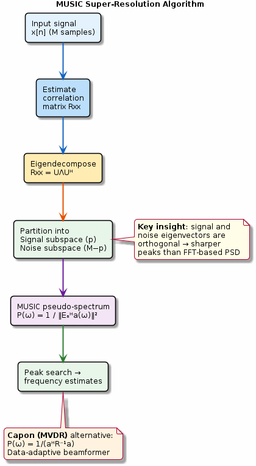

# Chapter 25: Parametric Spectral Estimation

MUSIC and Capon (MVDR) super-resolution algorithms.

## Concept Diagram

## Contents

| File | Description |
|------|------------|
| [tutorial.md](tutorial.md) | Full theory tutorial with equations and exercises |
| [demo.c](demo.c) | Self-contained runnable demo |
| [`spectral_est.h`](../../include/spectral_est.h) | Library API |

## What You'll Learn

- Decompose the correlation matrix into signal and noise subspaces
- Compute the MUSIC pseudo-spectrum for super-resolution
- Implement the Capon (MVDR) data-adaptive estimator
- Compare subspace methods with FFT-based approaches

---

[← Ch 24](../24-linear-prediction/README.md) | [Index](../../reference/CHAPTER_INDEX.md) | [Ch 26 →](../26-cepstrum-mfcc/README.md)
