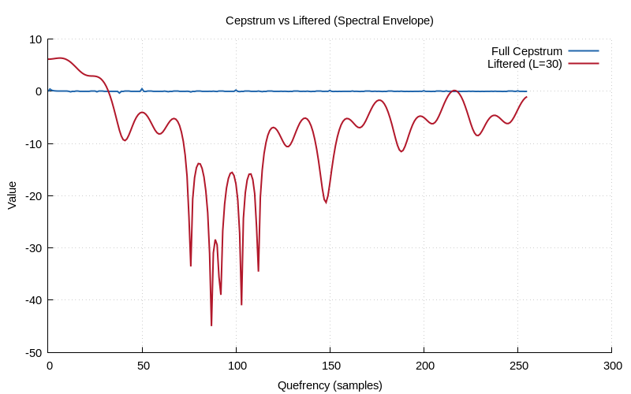
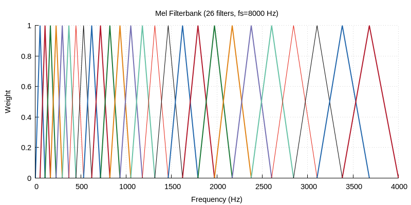

# Chapter 26 — Cepstrum Analysis & Mel-Frequency Cepstral Coefficients

## Overview

The **cepstrum** is the inverse Fourier transform of the log spectrum. It
operates in the **quefrency domain** where convolution becomes addition —
enabling separation of source and filter components. **MFCCs** extend this
by incorporating human auditory perception, making them the dominant feature
for speech and audio recognition.

## Key Concepts

### From Convolution to Addition

In speech production: x[n] = e[n] ∗ h[n] (excitation ∗ vocal tract).

```
Time:       x[n] = e[n] * h[n]           (convolution)
Spectrum:   X(f) = E(f) · H(f)           (multiplication)
Log:        log|X| = log|E| + log|H|     (addition)
Cepstrum:   c[n] = cₑ[n] + cₕ[n]        (addition in quefrency)
```

### Real Cepstrum

$$c[n] = \text{IFFT}\{\log|X(k)|\}$$

Properties:
- **Symmetric**: c[n] = c[−n] (even function)
- **Low quefrency**: spectral envelope (vocal tract shape)
- **High quefrency**: fine spectral structure (pitch harmonics)

### Complex Cepstrum

$$\hat{c}[n] = \text{IFFT}\{\log X(k)\} = \text{IFFT}\{\log|X(k)| + j\phi(k)\}$$

The complex cepstrum preserves phase information and is invertible —
enabling perfect reconstruction after modification.

### Liftering

"Liftering" (anagram of "filtering") in the quefrency domain:

- **Low-pass lifter**: Keep c[0..L−1], zero the rest → spectral envelope
- **High-pass lifter**: Zero c[0..L−1], keep the rest → pitch component

```
  cepstrum:
  ┌──────────────────────────┐
  │ ↑                        │
  │ │  env    pitch peak     │
  │ │   ↓      ↓             │
  │ ···│···│···│·····        │
  └──────────────────────────┘
    0  L-1     quefrency →
         ↑
     lifter cutoff
```

### Pitch Detection via Cepstrum

A periodic signal produces a peak in the cepstrum at the pitch period:
- **Quefrency of peak** = pitch period (in samples)
- **Frequency** = fs / pitch_period

Robust to formant structure (unlike autocorrelation-based methods).

## Mel-Frequency Cepstral Coefficients (MFCCs)

### The Mel Scale

Human hearing is approximately logarithmic in frequency above ~1 kHz:

$$m = 2595 \cdot \log_{10}(1 + f/700)$$

| Hz | Mel |
|----|-----|
| 0 | 0 |
| 200 | 283 |
| 500 | 607 |
| 1000 | 1000 |
| 2000 | 1523 |
| 4000 | 2146 |

### MFCC Pipeline

```
 signal → [Frame] → [Hamming] → [FFT] → [|·|²] → [Mel Fbank] → [log] → [DCT-II] → MFCCs
```

1. **Frame**: 20–30 ms window, 50% overlap
2. **Hamming window**: Reduce spectral leakage
3. **FFT → Power spectrum**: |X[k]|²
4. **Mel filterbank**: Triangular filters spaced on Mel scale
5. **Log**: Compresses dynamic range (mimics loudness perception)
6. **DCT-II**: Decorrelates filterbank energies → compact representation

### Mel Filterbank

The N_filt triangular filters are equally spaced on the Mel axis:

```
  ↑ weight
1 │    /\      /\      /\      /\
  │   /  \    /  \    /  \    /  \
  │  /    \  /    \  /    \  /    \
  │ /      \/      \/      \/      \
0 └─────────────────────────────────→ freq
    f₀   f₁  f₂   f₃  f₄   f₅  f₆
         (narrow)          (wide)
```

Filters are narrow at low frequencies, wide at high frequencies —
matching human frequency discrimination.

### Typical MFCC Parameters

| Parameter | Typical Value |
|-----------|--------------|
| Frame size | 25 ms |
| Frame shift | 10 ms |
| FFT size | 512 |
| Mel filters | 26 |
| MFCCs kept | 13 |
| Pre-emphasis | 1 − 0.97z⁻¹ |

### Why DCT?

The DCT decorrelates the log filterbank energies:
- Filterbank outputs are correlated (overlapping triangles)
- DCT produces uncorrelated coefficients
- First ~13 coefficients capture most of the spectral shape
- MFCC[0] ≈ log energy (often replaced by true frame energy)

## Applications

- **Speech recognition**: MFCCs are the standard front-end feature
- **Speaker identification**: MFCC + GMM or i-vectors
- **Music information retrieval**: Genre classification, instrument ID
- **Audio fingerprinting**: Shazam-like systems
- **Speech coding**: Spectral envelope representation

## Implementation Notes

- Pre-emphasis is optional but improves high-frequency modelling
- The zeroth MFCC (c₀) is often replaced with log frame energy
- Delta (Δ) and delta-delta (ΔΔ) features add temporal dynamics
- Cepstral mean normalisation (CMN) removes channel effects

## Demo

Run the Chapter 26 demo:
```bash
make chapters && ./build/bin/ch26
```

### Generated Plots






## Further Reading

- Oppenheim & Schafer, *Discrete-Time Signal Processing*, Chapter 13
- Davis & Mermelstein, "Comparison of Parametric Representations for
  Monosyllabic Word Recognition," *IEEE Trans. ASSP* (1980)
- Rabiner & Juang, *Fundamentals of Speech Recognition*, Chapter 3
