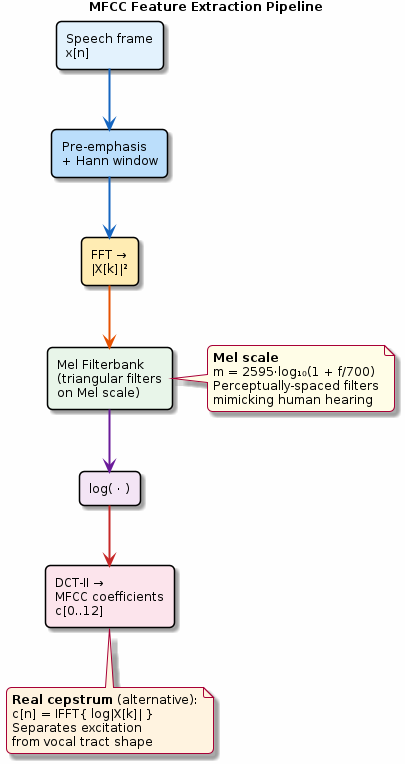

# Chapter 26: Cepstrum & MFCC

Real cepstrum, Mel-frequency cepstral coefficients, and speech features.

## Concept Diagram

## Contents

| File | Description |
|------|------------|
| [tutorial.md](tutorial.md) | Full theory tutorial with equations and exercises |
| [demo.c](demo.c) | Self-contained runnable demo |
| [`cepstrum.h`](../../include/cepstrum.h) | Library API |

## What You'll Learn

- Compute the real cepstrum via log-magnitude FFT
- Build a Mel filterbank with perceptually-spaced triangular filters
- Extract MFCC features for speech / audio analysis
- Understand liftering and delta coefficients

---

[← Ch 25](../25-parametric-spectral/README.md) | [Index](../../reference/CHAPTER_INDEX.md) | [Ch 27 →](../27-2d-dsp/README.md)
