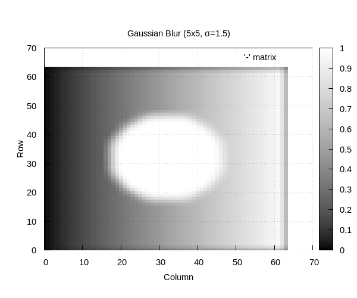
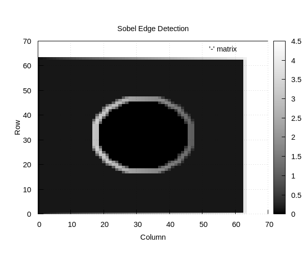

# Chapter 27 — Two-Dimensional DSP

## Overview

**Two-dimensional DSP** extends 1-D signal processing concepts to images
and other 2-D data. This chapter covers spatial convolution, standard
image processing kernels, and the 2-D FFT. Most operations translate
directly from their 1-D counterparts by applying the operation along
both rows and columns.

## Key Concepts

### 2-D Signals and Systems

An image is a 2-D signal: I(r, c) where r = row, c = column.
Pixel values represent intensity (greyscale) or colour channels.

A 2-D **linear shift-invariant (LSI)** system is characterised by its
2-D impulse response h(r, c) — the **point spread function (PSF)**.

### 2-D Convolution

$$y(r, c) = \sum_{i} \sum_{j} x(r-i, c-j) \cdot h(i, j)$$

Complexity: O(M·N·K²) for an M×N image with K×K kernel.

Boundary handling:
- **Zero-padding**: Assume pixels outside image are 0
- **Replicate**: Extend edge pixels
- **Wrap-around**: Periodic (natural for FFT-based)

### Standard Kernels

#### Gaussian Blur

$$G(x, y) = \frac{1}{2\pi\sigma^2} e^{-(x^2 + y^2)/(2\sigma^2)}$$

Smooths the image by averaging with Gaussian weights. Separable:
can be applied as two 1-D passes (row then column).

#### Sobel Gradient (Edge Detection)

```
  Gx = [-1  0  1]      Gy = [-1 -2 -1]
       [-2  0  2]           [ 0  0  0]
       [-1  0  1]           [ 1  2  1]

  Gradient magnitude = sqrt(Gx² + Gy²)
```

Detects edges by computing the image gradient in x and y directions.

#### Laplacian of Gaussian (LoG)

Combines Gaussian smoothing with second-derivative edge detection.
Zero-crossings of the LoG mark edge locations.

#### Sharpening

Enhances edges by adding a scaled Laplacian to the original:

$$\text{sharpened} = \text{original} + \alpha \cdot \nabla^2(\text{original})$$

### 2-D FFT

The 2-D DFT is separable — compute as two passes of 1-D FFTs:

$$X(u, v) = \sum_{r=0}^{M-1} \sum_{c=0}^{N-1} x(r,c) \, e^{-j2\pi(ur/M + vc/N)}$$

**Algorithm (row-column decomposition)**:
1. Apply 1-D FFT to each row → intermediate result
2. Apply 1-D FFT to each column → final 2-D FFT

Complexity: O(MN·log(MN)) — same as rearranging 1-D FFTs.

### 2-D Frequency Domain

```
  Low freq (DC)    ← centre (after shift)
       ↓
  ┌─────────────┐
  │      │      │
  │ 3    │  4   │
  │──────┼──────│   After fftshift:
  │ 1    │  2   │     DC moves to centre
  └─────────────┘     Edges = high freq
        ↓
  High freq (edges, texture)
```

- **Low frequencies**: Slow spatial variations (smooth areas)
- **High frequencies**: Rapid changes (edges, texture, noise)

### Frequency-Domain Filtering

$$Y(u,v) = X(u,v) \cdot H(u,v)$$

Steps:
1. FFT2D the image
2. Multiply by frequency response H(u,v)
3. IFFT2D to get filtered image

Common 2-D filters:
| Filter | H(u,v) |
|--------|---------|
| Ideal LPF | 1 if √(u²+v²) ≤ f_c else 0 |
| Gaussian LPF | exp(−(u²+v²)/(2σ²)) |
| Butterworth LPF | 1/(1+(d/f_c)^{2n}) |
| High-pass | 1 − H_LP(u,v) |

## Spatial vs Frequency Domain

| Criterion | Spatial | Frequency |
|-----------|---------|-----------|
| Small kernel (3×3) | Faster | Overhead too high |
| Large kernel (>15×15) | Slow | FFT is faster |
| Implementation | Simple | Complex |
| Boundary effects | Easy to control | Wrap-around |

Break-even point: roughly when kernel > ~11×11.

## Implementation Notes

- Image dimensions must be power-of-2 for FFT (or zero-pad)
- Greyscale: single double per pixel; colour: process each channel
- Normalise Gaussian kernel so entries sum to 1
- Clip output to valid range [0, 1] or [0, 255] after filtering
- For display: use gnuplot `with image` and grey palette

## Demo

Run the Chapter 27 demo:
```bash
make chapters && ./build/bin/ch27
```

### Generated Plots







## Further Reading

- Gonzalez & Woods, *Digital Image Processing* (4th ed.)
- Jain, *Fundamentals of Digital Image Processing*
- Oppenheim & Schafer, *Discrete-Time Signal Processing*, Chapter 11
