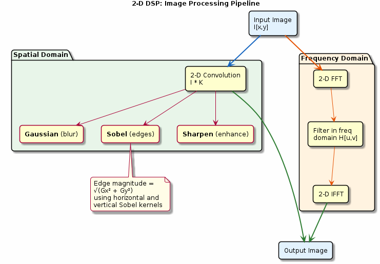

# Chapter 27: 2-D DSP

Image convolution, Sobel edge detection, and 2-D FFT.

## Concept Diagram

## Contents

| File | Description |
|------|------------|
| [tutorial.md](tutorial.md) | Full theory tutorial with equations and exercises |
| [demo.c](demo.c) | Self-contained runnable demo |

## What You'll Learn

- Apply 2-D convolution with Gaussian, Sobel, and sharpening kernels
- Compute edge magnitude from horizontal and vertical gradients
- Process images in the frequency domain using the 2-D FFT
- Understand spatial vs frequency-domain filtering trade-offs

---

[← Ch 26](../26-cepstrum-mfcc/README.md) | [Index](../../reference/CHAPTER_INDEX.md) | [Ch 28 →](../28-real-time-streaming/README.md)
