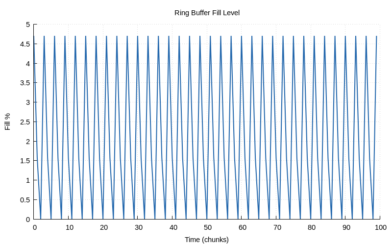
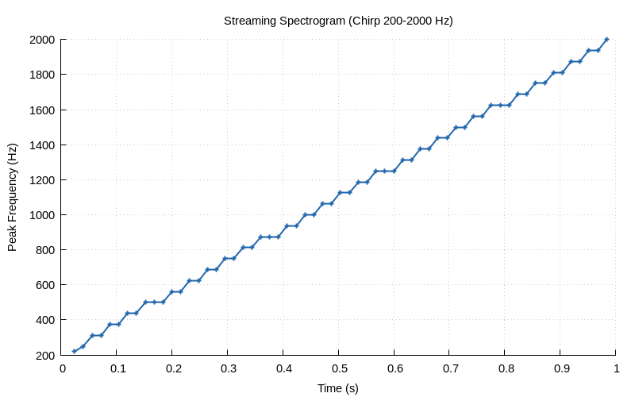
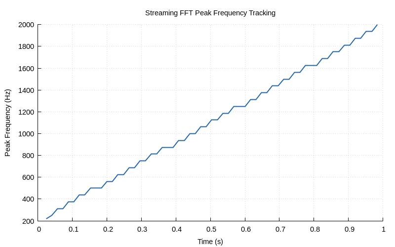

# Chapter 28 — Real-Time Streaming DSP

## Overview

**Real-time DSP** processes data continuously with bounded latency
— each block must be processed before the next arrives. This chapter
builds the infrastructure for streaming pipelines: ring buffers for
producer/consumer decoupling, overlap-add frame processors for
spectral analysis, and microsecond-resolution latency measurement.

## Key Concepts

### Real-Time Constraints

A real-time system must satisfy a **deadline**: the processing time
per block must be less than the block arrival interval.

$$T_{process} < T_{block} = \frac{N_{hop}}{f_s}$$

For example, with $f_s = 8000$ Hz and $N_{hop} = 128$ samples:

$$T_{block} = \frac{128}{8000} = 16\text{ ms}$$

Any processing exceeding 16 ms causes buffer overrun (data loss).

### Ring Buffer (Circular FIFO)

A **ring buffer** is the fundamental data structure for real-time audio:

```
  write ──►  [5][6][7][_][_][_][1][2][3][4]  ◄── read
              ↑                               ↑
             head                            tail
```

Properties:
- **O(1)** read/write (no shifting, just pointer increment)
- **Power-of-2** capacity enables bitwise modulo: `index & mask`
- **SPSC safe**: single-producer/single-consumer needs no locks
- **Leave-one-empty**: distinguishes full from empty

```c
available = (head - tail) & mask
space     = capacity - 1 - available
```

### Overlap-Add Frame Processing

Streaming spectral analysis uses overlapping frames:

```
  ┌─────────────────────────────────┐
  │ Frame 0:  [=========]           │  frame_size = N
  │ Frame 1:      [=========]       │  hop_size   = N/2  (50% overlap)
  │ Frame 2:          [=========]   │
  └─────────────────────────────────┘
```

Each frame is windowed (Hann), transformed via FFT, and analysed.
The hop size determines the time resolution vs. computation trade-off.

### Latency Measurement

Use `clock_gettime(CLOCK_MONOTONIC)` for µs-resolution timing:

```c
double t0 = timer_usec();
process_frame(fp, block, n);
double t1 = timer_usec();
latency_record(&stats, t1 - t0);
```

Track min/max/avg to detect worst-case jitter.

## Library API

### Ring Buffer

```c
RingBuffer *ring_buffer_create(int capacity);
void ring_buffer_destroy(RingBuffer *rb);
int  ring_buffer_write(RingBuffer *rb, const double *data, int n);
int  ring_buffer_read(RingBuffer *rb, double *data, int n);
int  ring_buffer_available(const RingBuffer *rb);
int  ring_buffer_space(const RingBuffer *rb);
int  ring_buffer_peek(const RingBuffer *rb, double *data, int n);
int  ring_buffer_skip(RingBuffer *rb, int n);
void ring_buffer_reset(RingBuffer *rb);
```

### Frame Processor

```c
FrameProcessor *frame_processor_create(int frame_size, int hop_size);
void frame_processor_destroy(FrameProcessor *fp);
int  frame_processor_feed(FrameProcessor *fp, const double *samples, int n);
int  frame_processor_peak_bin(const FrameProcessor *fp);
double frame_processor_peak_freq(const FrameProcessor *fp, double fs);
```

### Latency Timer

```c
double timer_usec(void);
void latency_init(LatencyStats *ls);
void latency_record(LatencyStats *ls, double us);
double latency_avg(const LatencyStats *ls);
```

## Design Decisions

1. **Pre-allocation only** — no malloc during processing loop
2. **Power-of-2 ring buffer** — bitwise AND instead of modulo
3. **Hann window** — good spectral leakage suppression
4. **POSIX timer** — portable across Linux/macOS, µs resolution

## Demo

Run the Chapter 28 demo:
```bash
make chapters && ./build/bin/ch28
```

The demo:
1. Exercises the ring buffer API (write, read, peek, skip, wrap)
2. Streams a chirp signal through the frame processor
3. Displays an ASCII spectrogram showing frequency tracking
4. Measures processing latency for various frame sizes

### Generated Plots







## Further Reading

- Smith, *The Scientist and Engineer's Guide to DSP*, Ch. 28-29
- Lock-free ring buffers: Lamport, *Proving the Correctness of Multiprocess Programs*
- JACK Audio: <https://jackaudio.org/> — real-time audio framework

---

| [← Ch 27: 2D DSP](27-2d-dsp.md) | [Index](../reference/CHAPTER_INDEX.md) | [Ch 29: Optimisation →](29-optimisation.md) |
