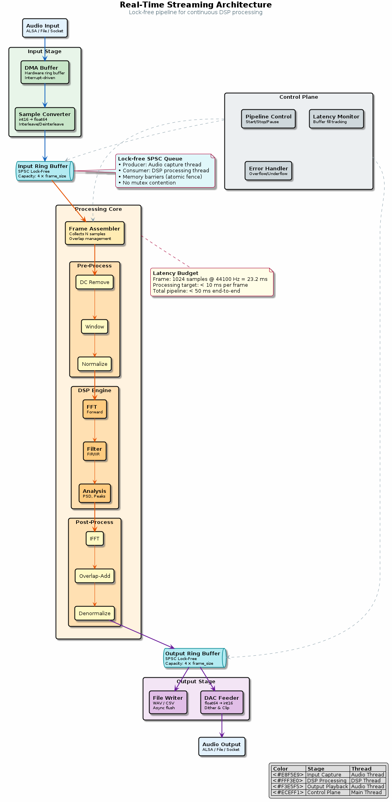

# Chapter 28: Real-Time Streaming

Ring buffers, block processing, and real-time DSP architecture.

## Concept Diagram

## Contents

| File | Description |
|------|------------|
| [tutorial.md](tutorial.md) | Full theory tutorial with equations and exercises |
| [demo.c](demo.c) | Self-contained runnable demo |
| [`realtime.h`](../../include/realtime.h) | Library API |

## What You'll Learn

- Implement a lock-free ring buffer for streaming I/O
- Process audio in fixed-size blocks with overlap
- Measure and control real-time latency
- Integrate DSP modules into a real-time pipeline

---

[← Ch 27](../27-2d-dsp/README.md) | [Index](../../reference/CHAPTER_INDEX.md) | [Ch 29 →](../29-optimisation/README.md)
