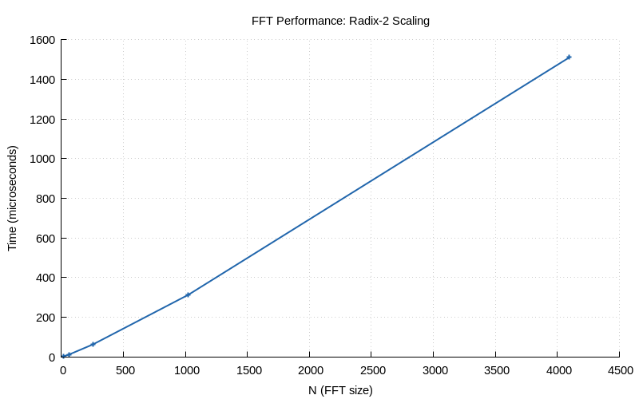
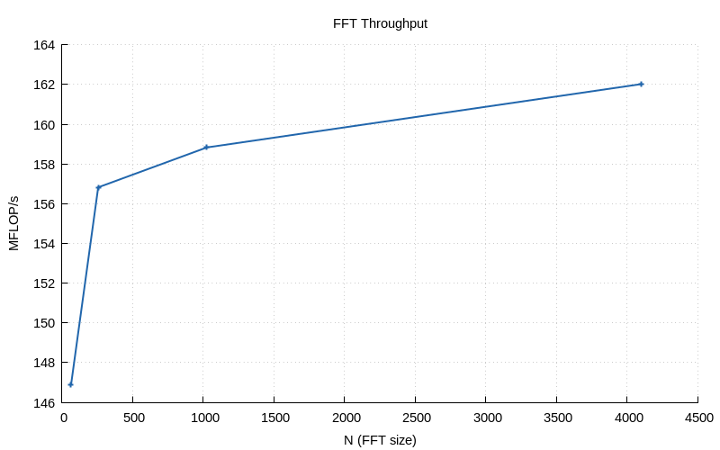
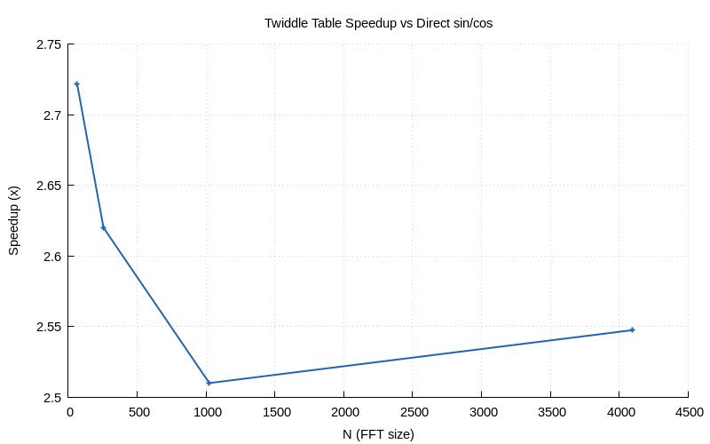

# Chapter 29 — DSP Optimisation

## Overview

Once algorithms are correct, we make them fast. This chapter covers
optimisation techniques ranging from algorithmic improvements (radix-4
FFT) to data-level tricks (pre-computed twiddle tables, aligned memory).
We benchmark each technique and measure actual speedups.

## Key Concepts

### The Optimisation Ladder

```
  Stage 1  Baseline C99          ──  1×  (our current radix-2 FFT)
  Stage 2  Compiler -O3 -flto    ── ~2×  (already enabled in Makefile)
  Stage 3  Algorithm (radix-4)   ── ~1.3×
  Stage 4  Pre-computed twiddles ── ~1.2×
  Stage 5  SIMD (AVX2/NEON)      ── ~4×  (platform-specific, discussed)
  Stage 6  Multithreading        ── ~Nx  (discussed, not implemented)
```

Rule: **always optimise in this order**. Algorithmic improvements
compound with hardware-level speedups.

### Radix-4 FFT

The standard Cooley-Tukey FFT uses radix-2 butterflies:

$$X[k] = E[k] + W_N^k \cdot O[k]$$

A **radix-4** butterfly processes 4 elements at once:

$$X[k]       = a + b + c + d$$
$$X[k+N/4]   = a - jb - c + jd$$
$$X[k+N/2]   = a - b + c - d$$
$$X[k+3N/4]  = a + jb - c - jd$$

where $W_N^{N/4} = -j$ and $W_N^{N/2} = -1$ are "free" twiddle factors.

**Advantage**: 25% fewer complex multiplications than radix-2.
$\frac{3}{8} N \log_4 N$ vs $\frac{1}{2} N \log_2 N$.

**Constraint**: N must be a power of 4 (4, 16, 64, 256, 1024, ...).

### Pre-computed Twiddle Tables

The inner FFT loop computes $W_N^k = e^{-j2\pi k/N}$, requiring
`sin()` and `cos()` — each taking ~100 CPU cycles on x86.

Pre-computing a lookup table eliminates this cost:

```c
TwiddleTable *tt = twiddle_create(N);
fft_with_twiddles(x, N, tt);   // table lookup instead of sin/cos
twiddle_destroy(tt);
```

Memory cost: $N/2$ complex values ($8N$ bytes for double precision).

### Aligned Memory

SIMD instructions require specific memory alignment:

| Instruction Set | Required Alignment |
|----------------|--------------------|
| SSE (128-bit)  | 16 bytes           |
| AVX (256-bit)  | 32 bytes           |
| AVX-512        | 64 bytes           |
| NEON (ARM)     | 16 bytes           |

Standard `malloc()` only guarantees 8 or 16-byte alignment.
Our `aligned_alloc_dsp()` provides portable aligned allocation
in pure C99 by over-allocating and adjusting the pointer.

### Micro-Benchmarking

Reliable benchmarks require:
1. **Many iterations** (≥50) to amortise cache and branch predictor warm-up
2. **Identical input** for each run (use deterministic PRNG)
3. **Monotonic clock** for timing (`CLOCK_MONOTONIC`)
4. **Report min/avg/max** to capture variance

## Library API

### Benchmarking

```c
BenchResult bench_fft_radix2(int n, int runs);
BenchResult bench_fft_radix4(int n, int runs);
void bench_print(const char *label, const BenchResult *r);
```

### Radix-4 FFT

```c
void fft_radix4(Complex *x, int n);    // N must be power of 4
void ifft_radix4(Complex *x, int n);
```

### Twiddle Table

```c
TwiddleTable *twiddle_create(int n);
void twiddle_destroy(TwiddleTable *tt);
void fft_with_twiddles(Complex *x, int n, const TwiddleTable *tt);
```

### Aligned Memory

```c
void *aligned_alloc_dsp(int alignment, int size);
void  aligned_free_dsp(void *ptr);
```

## Demo

Run the Chapter 29 demo:
```bash
make chapters && ./build/bin/ch29
```

The demo:
1. Benchmarks radix-2 vs radix-4 FFT at various sizes
2. Verifies radix-4 correctness against radix-2
3. Measures twiddle table speedup
4. Demonstrates aligned memory allocation
5. Generates comparison plots

### Generated Plots







## Further Reading

- Johnson & Frigo, *Implementing FFTs in Practice* (FFTW paper)
- Intel, *Intrinsics Guide*: <https://software.intel.com/sites/landingpage/IntrinsicsGuide/>
- Agner Fog, *Optimizing software in C++*: <https://www.agner.org/optimize/>

---

| [← Ch 28: Real-Time Streaming](28-real-time-streaming.md) | [Index](../reference/CHAPTER_INDEX.md) | [Ch 30: Capstone →](30-putting-it-together.md) |
