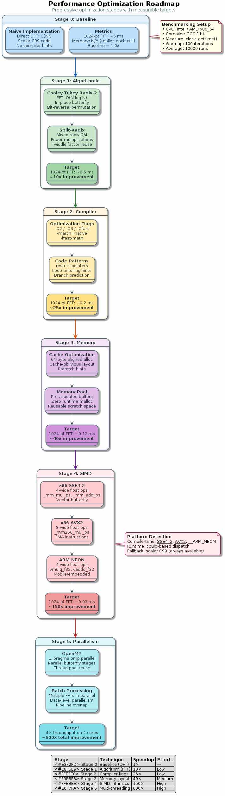

# Chapter 29: Optimisation

Radix-4 FFT, pre-computed twiddle tables, and aligned memory.

## Concept Diagram

## Contents

| File | Description |
|------|------------|
| [tutorial.md](tutorial.md) | Full theory tutorial with equations and exercises |
| [demo.c](demo.c) | Self-contained runnable demo |
| [`optimization.h`](../../include/optimization.h) | Library API |

## What You'll Learn

- Apply radix-4 butterfly to reduce FFT multiplications by 25%
- Pre-compute and cache twiddle factors
- Use aligned memory allocation for cache-friendly access
- Benchmark optimised vs baseline implementations

---

[← Ch 28](../28-real-time-streaming/README.md) | [Index](../../reference/CHAPTER_INDEX.md) | [Ch 30 →](../30-putting-it-together/README.md)
