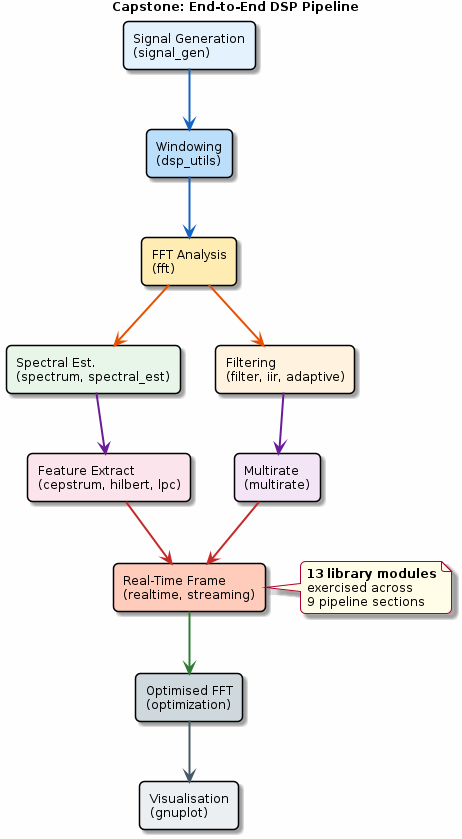

# Chapter 30: Capstone: Putting It All Together

End-to-end DSP pipeline integrating all modules from the suite.

## Concept Diagram

## Contents

| File | Description |
|------|------------|
| [tutorial.md](tutorial.md) | Full theory tutorial with equations and exercises |
| [demo.c](demo.c) | Self-contained runnable demo |

## What You'll Learn

- Chain signal generation → windowing → FFT → filtering → output
- Combine multirate processing with spectral estimation
- Apply real-time streaming with optimised transforms
- Build a complete DSP application from library modules

---

[← Ch 29](../29-optimisation/README.md) | [Index](../../reference/CHAPTER_INDEX.md)
