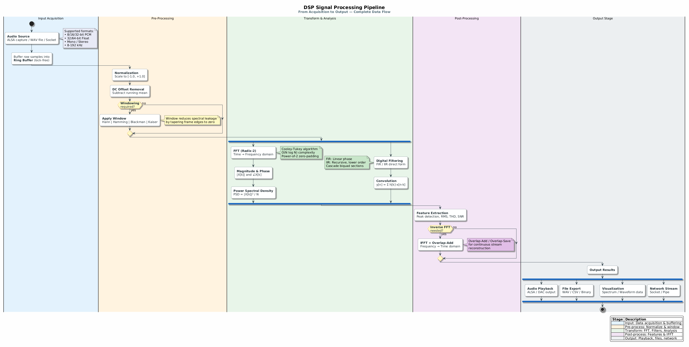

# FFT DSP Toolkit

A lightweight educational toolkit for learning and experimenting with Digital Signal Processing (DSP) concepts, focused on Fast Fourier Transform (FFT) implementations.

## Architecture


The FFT uses the Cooley-Tukey butterfly algorithm:
- **Stage 1**: Split input into even and odd samples
- **Stage 2**: Compute smaller FFTs recursively
- **Stage 3**: Combine with twiddle factors W



## Features
- Clean repo structure (`src/`, `include/`, `examples/`, `tests/`, `docs/`)
- Starter FFT and FIR filter implementations in C
- Unit tests for reproducibility
- Notes and references from classic DSP textbooks (Haykin, Proakis, Oppenheim & Schafer)
- Makefile for easy builds on Linux/Raspberry Pi

## Getting Started
```bash
make
./build/fft_demo
./build/filter_demo
```
