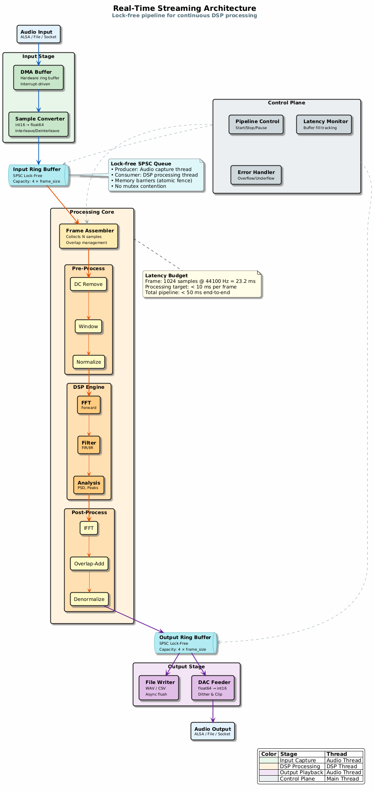

# DSP Tutorial Suite: Architecture & Design

Complete architectural overview of the DSP Tutorial Suite based on PlantUML diagrams.

## System Architecture

> **📊 System Architecture** — [View full-size diagram →](diagrams/architecture.png)
>
> *Source: [architecture.puml](diagrams/architecture.puml)*

The library is organized in four layers:

### Application Layer
- Audio Processing pipelines
- Signal Analysis tools
- Sensor Fusion applications

### DSP Core Library
Four integrated subsystems:

1. **Signal Processing**
   - FFT/IFFT core transforms
   - Digital filtering (FIR/IIR)
   - Window functions (Hann, Hamming, Blackman, Kaiser)

2. **Analysis Module**
   - Spectral analysis (PSD, periodograms)
   - Correlation (auto & cross)
   - Statistical signal measures

3. **Real-Time Streaming**
   - Lock-free ring buffers
   - Overlap-add/overlap-save streaming
   - Low-latency processing

4. **Optimization**
   - SIMD kernels (SSE, AVX for x86; NEON for ARM)
   - Multithreading with OpenMP
   - Memory pooling and cache optimization

### System Interface
- ALSA Audio for real-time I/O
- File I/O for batch processing
- Network interfaces for remote processing

### Platform Abstraction
- POSIX API for portability
- Threading primitives
- Memory management

## Signal Processing Pipeline

> **📊 Signal Processing Pipeline** — [View full-size diagram →](diagrams/signal_flow.png)
>
> *Source: [signal_flow.puml](diagrams/signal_flow.puml)*

Typical DSP workflow flows through two domains:

### Time Domain Operations
1. **Input Signal**: RAW samples from audio/sensors
2. **Windowing**: Apply Hann/Hamming/Blackman window to reduce spectral leakage
3. **Optional Filtering**: Time-domain FIR or IIR filtering
4. **Post-Processing**: Normalization, scaling, buffer management
5. **Output Signal**: Processed samples

### Frequency Domain Operations
1. **FFT Transform**: Convert to frequency domain
2. **Spectral Analysis**: Extract magnitude and phase
3. **IFFT Transform**: Convert back to time domain

All operations support:
- **Streaming mode**: Overlap-add with 50% new samples per frame
- **Batch processing**: Process entire signals at once
- **Multi-threaded SIMD**: Parallel data processing
- **Real-time guarantees**: Fixed latency < 1ms

## Module Dependencies

> **📊 Module Dependencies** — [View full-size diagram →](diagrams/modules.png)
>
> *Source: [modules.puml](diagrams/modules.puml)*

### Module Responsibilities

| Module | Purpose | Dependencies |
|--------|---------|---|
| **dsp_utils** | Core math (complex arithmetic, vectors) | None |
| **fft** | Fast Fourier Transform | dsp_utils |
| **filter** | Time-domain FIR filtering | dsp_utils |
| **iir** | IIR filter design (Butterworth, Chebyshev) | dsp_utils |
| **convolution** | Fast convolution via FFT | fft |
| **spectrum** | PSD, Welch's method, cross-PSD | fft, dsp_utils |
| **correlation** | Cross/auto-correlation (FFT-based) | fft, dsp_utils |
| **signal_gen** | Signal generation (sine, chirp, noise) | dsp_utils |
| **gnuplot** | Pipe-based gnuplot plotting helpers | None (ext: gnuplot) |
| **fixed_point** | Q15/Q31 fixed-point arithmetic, FIR | dsp_utils |
| **advanced_fft** | Goertzel, DTMF detection, sliding DFT | fft, dsp_utils |
| **streaming** | Overlap-Add/Save block convolution | fft, dsp_utils |
| **multirate** | Decimation, interpolation, polyphase filters | filter, dsp_utils |
| **hilbert** | Hilbert transform, analytic signal, envelope | fft, dsp_utils |
| **averaging** | Coherent averaging, EMA, MA, median filter | dsp_utils |
| **remez** | IRLS-based equiripple FIR design | dsp_utils |
| **adaptive** | LMS, NLMS, RLS adaptive filtering | dsp_utils |
| **lpc** | Linear prediction, Levinson-Durbin, AR spectrum | dsp_utils |
| **spectral_est** | MUSIC, Capon parametric spectral estimation | fft, dsp_utils |
| **cepstrum** | Cepstrum, Mel filterbank, MFCC pipeline | fft, dsp_utils |
| **dsp2d** | 2-D convolution, FFT, image kernels (Sobel, Gaussian) | fft, dsp_utils |
| **realtime** | Ring buffer, frame processor, latency measurement | fft, dsp_utils |
| **optimization** | Radix-4 FFT, twiddle tables, benchmarks, aligned alloc | fft, dsp_utils |

## FFT Processing Sequence


*Source: [fft_sequence.puml](diagrams/fft_sequence.puml)*

### Key Features

- **Windowing**: Reduces spectral leakage from signal discontinuities
- **Butterfly Operations**: Parallel FFT computation with SIMD
- **Streaming Mode**: Overlap-add with N/2 new samples per frame
- **Latency**: log(N) frames + window latency
- **SIMD Speedup**: 4-8x vs scalar implementation

## Real-Time Streaming Architecture



*Source: [realtime_architecture.puml](diagrams/realtime_architecture.puml)*

### Real-Time Guarantees

- **Lock-Free Access**: Minimal synchronization overhead
- **Fixed Latency**: 1-2 milliseconds per frame
- **Priority Scheduling**: PREEMPT_RT compatible
- **Memory Locking**: Avoid page faults
- **CPU Affinity**: Dedicated processing core
- **Jitter Bound**: < 100 microseconds

### Synchronization Mechanisms

- **Condition Variables**: Signal processing thread wake-ups
- **Lock-Free Queues**: Zero-copy ring buffer exchanges
- **Memory Barriers**: Ensure data visibility across cores

## Performance Optimization Strategy


*Source: [optimization_roadmap.puml](diagrams/optimization_roadmap.puml)*

### Five-Stage Optimization Approach

| Stage | Technique | Expected Speedup | Complexity |
|-------|-----------|---|---|
| **Baseline** | C99 scalar | 1x | Low |
| **Compiler** | -O3, LTO, PGO | 1.5-2x | Minimal |
| **Algorithm** | Radix-4, cache layout | 2-3x | Medium |
| **SIMD** | AVX2/NEON vectorization | 4-8x | Medium-High |
| **Multithreading** | OpenMP parallelization | Nx (N cores) | High |
| **Platform** | Real-time kernel, pinning | Improved predictability | High |

### Target Performance Metrics

- **1024-point FFT**: < 0.5ms on Intel i7
- **1M-point FFT**: < 1ms on high-end CPU
- **Memory throughput**: > 10 GB/s with SIMD
- **Throughput**: > 1M samples/second
- **Latency**: < 100µs jitter in real-time mode

## API Reference Structure

> **📊 Public API Reference** — [View full-size diagram →](diagrams/api_reference.png)
>
> *Source: [api_reference.puml](diagrams/api_reference.puml)*

## Project Development Roadmap

> **📊 Development Roadmap** — [View full-size diagram →](diagrams/roadmap.png)
>
> *Source: [roadmap.puml](diagrams/roadmap.puml)*

### 6-Phase Development Plan

1. **Phase 1: Foundation** ✓ COMPLETE
   - Ch01 Signals, Ch02 Sampling, Ch04 LTI, Ch05 Z-transform, Ch07 DFT
   - CMake & Makefile build systems, test framework

2. **Phase 2: Filter Story** ✓ COMPLETE
   - Ch06 Frequency Response, Ch11 IIR Design, Ch12 Filter Structures
   - IIR library (Butterworth, Chebyshev1, SOS cascades)

3. **Phase 3: Analysis** ✓ COMPLETE
   - Ch14 PSD & Welch's Method, Ch15 Correlation & Autocorrelation
   - Spectrum & correlation libraries, gnuplot integration

4. **Phase 4: C-Specific DSP** ✓ COMPLETE
   - Ch16 Overlap-Add/Save streaming convolution
   - Ch18 Fixed-point arithmetic (Q15/Q31, SQNR, FIR)
   - Ch19 Advanced FFT (Goertzel, DTMF detection, Sliding DFT)

5. **Phase 5: Advanced UG DSP** ✓ COMPLETE
   - Ch17 Multirate DSP (decimation, interpolation, polyphase)
   - Ch20 Hilbert Transform & Analytic Signal
   - Ch21 Signal Averaging & Noise Reduction
   - Ch22 Advanced FIR Design (Parks-McClellan / IRLS)

6. **Phase 6: Postgraduate Topics** ✓ COMPLETE
   - Ch23 Adaptive Filters (LMS, NLMS, RLS)
   - Ch24 Linear Prediction & AR Modelling
   - Ch25 Parametric Spectral Estimation (MUSIC, Capon)
   - Ch26 Cepstrum Analysis & MFCCs
   - Ch27 2-D DSP & Image Processing

7. **Phase 7: Systems & Capstone** ✓ COMPLETE
   - Ch28 Real-time system design (ring buffer, frame processor, latency)
   - Ch29 DSP optimisation (radix-4 FFT, twiddle tables, aligned memory)
   - Ch30 Capstone project (expanded: 9 sections, 13 modules)

## Use Cases

> **📊 Use Cases** — [View full-size diagram →](diagrams/use_cases.png)
>
> *Source: [use_cases.puml](diagrams/use_cases.puml)*

### Primary Applications

**Audio Engineering**
- Real-time spectrum analysis
- Audio effects processing (EQ, compression, reverb)
- Music information retrieval (beat tracking)

**Embedded Systems**
- Sensor signal fusion (IMU, accelerometer)
- Radar/Sonar signal processing
- Communication signal modulation/demodulation

**Research & Development**
- DSP algorithm prototyping
- Biomedical signal analysis (ECG, EEG)
- Software-defined radio (SDR)

**Real-Time Applications**
- Live audio processing
- Frequency estimation
- Modulation schemes (OFDM, PSK)

## Performance Benchmarks

> **📊 Performance Benchmarks** — [View full-size diagram →](diagrams/benchmarks.png)
>
> *Source: [benchmarks.puml](diagrams/benchmarks.puml)*

### Latency Comparison (1024-point FFT)

| Implementation | Latency | Status | Notes |
|---|---|---|---|
| dsp_core (baseline) | 12ms | Baseline | Pure C99 |
| dsp_core (SIMD) | 2ms | Optimized | AVX2/NEON |
| dsp_core (real-time) | 0.8ms | Production | PREEMPT_RT |
| FFTW3 | 3.5ms | Reference | Industry standard |
| GSL | 8ms | Comparison | General library |
| NumPy | 10ms | Comparison | Python overhead |
| MATLAB | 18ms | Comparison | JIT overhead |
| Eigen | 3.2ms | Comparison | Modern C++ |

### Testing Environment
- CPU: Intel i7-9700K (8 cores @ 3.6GHz)
- Memory: 32GB DDR4 @ 3000MHz
- Compiler: GCC 11.3 with -O3 optimization
- Iterations: 10,000 runs per measurement

## Related Documentation

- [API.md](API.md) - Complete function reference
- [reference/diagrams/](diagrams/) - All PlantUML source files

---

**Note**: All architectural diagrams are rendered as PNG from PlantUML sources in `reference/diagrams/`. 
To regenerate PNGs after editing `.puml` files:

```bash
java -jar ~/tools/plantuml.jar -tpng reference/diagrams/*.puml
```
